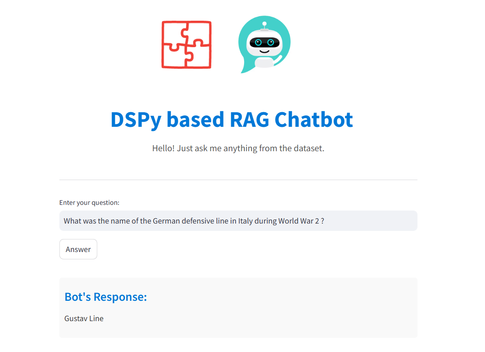

### Xây dựng 1 hệ thống RAG cơ bản ứng dụng framework DSPy

1. File .ipynb sẽ đi qua từng phần nhỏ của project.
2. Từ các phần vừa tìm hiểu xây dựng 1 hệ thống RAG với bộ dataset riêng và deploy lên streamlist (file main.py)

DEMO:

